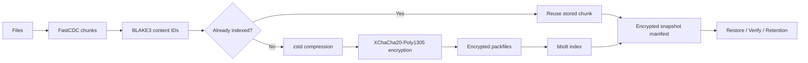

# Backup Engine

Backup Engine is a local-first backup tool written in Go. It creates encrypted, content-defined, deduplicated snapshots and provides both a full-screen terminal interface and scriptable CLI commands.

## Features

- FastCDC content-defined chunking
- zstd compression before encryption
- XChaCha20-Poly1305 authenticated encryption
- BLAKE3 content and storage identifiers
- Deduplication across snapshots in one repository
- Encrypted snapshot metadata (protobuf wire format) and repository key-check validation
- Symlinks, POSIX permissions, ownership, and extended attributes (including POSIX ACLs, carried as xattrs) are captured and restored
- Local packfile storage with a bbolt index
- Snapshot restore, integrity verification, and repository diagnostics
- Grandfather-Father-Son retention and garbage collection
- Bubble Tea terminal interface with path completion and safety profiles
- Phase progress, operation activity, completion summaries, and recovery guidance
- Concise, verbose, quiet, and JSON CLI output modes
- **Credential input via file or environment variable** (`-passphrase-file`, `-salt-file`, `BACKUP_ENGINE_PASSPHRASE`, `BACKUP_ENGINE_SALT`)
- **S3 Object Lock / WORM retention** (`-s3-object-lock-days`, `-s3-object-lock-compliance`)
- **Disaster recovery** (`recover` rebuilds a repository from a remote replica)
- **Bit-rot scrubbing** (`scrub` validates every packfile's checksum without decrypting)
- **Version introspection** (`version` subcommand)

## Quick Start

Requirements: Go 1.27 or a compatible newer toolchain.

```bash
go build ./cmd/backup-engine
```

Initialize a repository. The salt must contain at least 16 bytes. Keep both the passphrase and salt available: losing either can make the repository unrecoverable.

```bash
./backup-engine init \
  -repo /tmp/backup-repo \
  -passphrase "choose-a-strong-passphrase" \
  -salt "0123456789abcdef"
```

Create a snapshot:

```bash
./backup-engine backup \
  -repo /tmp/backup-repo \
  -source ~/Documents \
  -passphrase "choose-a-strong-passphrase" \
  -salt "0123456789abcdef" \
  -tags DAILY
```

List snapshots and restore one:

```bash
./backup-engine list-snapshots \
  -repo /tmp/backup-repo \
  -passphrase "choose-a-strong-passphrase" \
  -salt "0123456789abcdef"

./backup-engine restore \
  -repo /tmp/backup-repo \
  -snapshot <SNAPSHOT_ID> \
  -dest /tmp/restored \
  -passphrase "choose-a-strong-passphrase" \
  -salt "0123456789abcdef"
```

Run verification after important backups and restores:

```bash
./backup-engine verify \
  -repo /tmp/backup-repo \
  -passphrase "choose-a-strong-passphrase" \
  -salt "0123456789abcdef"
```

See [usage.md](usage.md) for the complete command reference and operational workflow.

## Terminal Interface

Run the binary without arguments in an interactive terminal, or use the explicit subcommand:

```bash
./backup-engine
# or
./backup-engine tui
```

The dashboard contains Overview, Activity, Repository, Backup, Restore, Snapshots, History, Health, Retention, and Setup sections. Operations show their current phase, aggregate counters, elapsed time, recent activity, and a final transaction summary with a suggested next step.

Key controls:

| Key | Action |
| --- | --- |
| `up` / `down`, `k` / `j` | Navigate sections and lists |
| `enter` | Open, select, or submit |
| `tab` | Complete paths or cycle matching directories |
| `/` | Filter snapshots |
| `s` | Open descriptions and select a safety profile |
| `d` | Trash or untrash the selected snapshot |
| `p` | Pin or unpin the selected snapshot |
| `x` | Permanently and instantly remove the selected snapshot (bypasses trash) |
| `e` | Edit encrypted labels, note, and retain-until date |
| `?` | Toggle expanded help |
| `esc` | Return from a form or result |
| `q`, `ctrl+c` | Quit from dashboard views |

Passphrases and salts are masked. Activity history is bounded and exists only for the current TUI session. Every operation (backup, restore, gc, verify, doctor, snapshot remove, replicate, init) is additionally recorded as an encrypted entry in a persistent transaction history that survives across sessions and process restarts; see the `history` command and the TUI's History section below.

Snapshot rows show the creation date in local time with timezone, status, lifecycle state, file count, and logical size. The selected details show the exact UTC timestamp, full metadata, labels, note, and retention overrides.

Safety profiles are interaction safeguards, not substitutes for independent backups or immutable storage. Strict explains and strongly confirms destructive actions; Standard confirms destructive actions with less friction; Fast skips confirmation only for reversible actions. Garbage collection always requires explicit confirmation.

## Managing Snapshots

Manual removal uses recoverable trash rather than immediate deletion. A trashed snapshot is hidden from the active list but remains restorable until its purge date, seven days by default. Storage is reclaimed only when garbage collection runs after that deadline.

For cases where destination space must be reclaimed right away, `snapshot remove` (CLI) or `x` (TUI) permanently deletes a snapshot immediately, bypassing trash entirely. It removes the snapshot's now-unreferenced chunks and repacks any affected packfiles on the spot, so disk usage drops immediately rather than waiting for a scheduled `gc`. This is irreversible and requires explicit confirmation (`-yes` on the CLI, a typed `REMOVE` in the TUI unless the Fast safety profile is active).

```bash
./backup-engine snapshot list -repo /tmp/backup-repo -passphrase "..." -salt "..."
./backup-engine snapshot show -repo /tmp/backup-repo -passphrase "..." -salt "..." -id <ID>
./backup-engine snapshot trash -repo /tmp/backup-repo -passphrase "..." -salt "..." -id <ID>
./backup-engine snapshot untrash -repo /tmp/backup-repo -passphrase "..." -salt "..." -id <ID>
./backup-engine snapshot pin -repo /tmp/backup-repo -passphrase "..." -salt "..." -id <ID>
./backup-engine snapshot remove -repo /tmp/backup-repo -passphrase "..." -salt "..." -id <ID> -yes
./backup-engine snapshot edit -repo /tmp/backup-repo -passphrase "..." -salt "..." -id <ID> -labels important -note "Monthly archive" -retain-until 2030-01-01T00:00:00Z
```

Pinned snapshots and active snapshots with a future retain-until deadline override normal GFS expiration. Explicit trash takes precedence after its recovery window expires. Labels, notes, pins, and lifecycle dates are encrypted and do not alter immutable snapshot contents or IDs.

## CLI Output

Operational commands support consistent output controls:

- `--verbose`: show phase progress and detailed summaries.
- `--quiet`: retain only the primary command result.
- `--json`: emit one machine-readable final result and disable progress output.

Interactive terminals receive richer summaries by default. Redirected output remains concise so existing shell workflows continue to work.

## How It Works



Backup data is chunked by content, compressed, encrypted, and aggregated into immutable packfiles. The local index maps content identifiers to encrypted storage locations. Snapshot manifests reference those locations and are encrypted separately. Restore resolves each referenced chunk, authenticates and decrypts it, decompresses it, and verifies the reconstructed file hash.

For format and security details, see [architecture_specification.md](architecture_specification.md).

## Repository Layout

A local repository currently contains:

```text
<repository>/
├── index/
│   └── index.db
└── data/
    └── packs/
        └── <blake3-pack-id>.pack
```

The bbolt database contains chunk mappings, snapshot envelopes, and key-check metadata. Packfiles contain encrypted chunk records and a checksummed tail index.

Do not edit repository files manually. Keep independent copies of the entire repository directory.

## Storage Backends

By default, every command that opens a repository uses local filesystem packfile storage under `<repository>/data`. The bbolt index (chunk mappings, snapshot envelopes, key-check metadata) is always local.

Packfiles can instead be stored in a MinIO or other S3-compatible bucket by adding `-storage-backend minio` plus connection flags to any repository command (`init`, `backup`, `restore`, `list-snapshots`, `snapshot`, `gc`, `verify`, `doctor`):

```bash
./backup-engine backup \
  -repo /tmp/backup-repo \
  -source ~/Documents \
  -passphrase "choose-a-strong-passphrase" \
  -salt "0123456789abcdef" \
  -storage-backend minio \
  -s3-endpoint localhost:9000 \
  -s3-bucket backup-engine-packs \
  -s3-prefix optional/key/prefix \
  -s3-access-key "$AWS_ACCESS_KEY_ID" \
  -s3-secret-key "$AWS_SECRET_ACCESS_KEY" \
  -s3-use-ssl=true
```

`-s3-access-key`/`-s3-secret-key` fall back to the `AWS_ACCESS_KEY_ID`/`AWS_SECRET_ACCESS_KEY` environment variables when omitted. Use the same `-storage-backend`/`-s3-*` flags consistently across every command against a given repository; mixing backends for the same repository will make packs written under one backend invisible to commands using the other.

### S3 Object Lock (immutability)

Adding `-s3-object-lock-days N` (with `-storage-backend minio`) makes every uploaded pack request S3 Object Lock retention for `N` days in GOVERNANCE mode, so it cannot be deleted or overwritten until the retention period elapses, even by a compromised or malicious client holding valid credentials — add `-s3-object-lock-compliance` for the stronger, **irreversible** COMPLIANCE mode, which not even the bucket owner or root credentials can shorten or bypass. Choose COMPLIANCE deliberately; it is not a safe default.

Object Lock is a bucket-creation-time property in S3 and **cannot be enabled on an existing bucket**. Before uploading, `init` and `replicate run` run a preflight check (`GetObjectLockConfig`) and fail with a clear error if `-s3-object-lock-days` is set against a bucket that was not created with Object Lock support:

```bash
mc mb --with-lock local/backup-engine-offsite   # bucket must be created with Object Lock enabled
./backup-engine replicate run \
  -repo /tmp/backup-repo -passphrase "..." -salt "0123456789abcdef" \
  -remote-storage-backend minio -remote-s3-endpoint offsite-host:9000 -remote-s3-bucket backup-engine-offsite \
  -remote-s3-access-key "$OFFSITE_ACCESS_KEY" -remote-s3-secret-key "$OFFSITE_SECRET_KEY" \
  -remote-s3-object-lock-days 30
```

Large packfiles upload via multipart automatically: the underlying `minio-go` client switches from a single-shot `PutObject` to multipart streaming once an object exceeds its internal part-size threshold (16 MiB by default), with no extra configuration needed here.

## Performance

`pkg/chunker.BenchmarkFastCDCThroughput` and `pkg/pipeline.BenchmarkBackupPathDetailed` are informational (non-failing) benchmarks establishing a baseline for backup throughput; run them with `go test ./pkg/chunker/... -bench BenchmarkFastCDCThroughput -benchmem` (similarly for the pipeline benchmark). `FastCDC.NextChunk` returns chunks that alias its internal buffer instead of copying, cutting allocations from ~1 per emitted chunk to a handful for an entire file — the returned `Chunk.Data` is only valid until the next `NextChunk()` call. A blocked Bloom filter (`pkg/pipeline/bloom.go`), built from the existing CID directory when a repository opens, short-circuits the bbolt dedup lookup for definite-miss (genuinely new) chunks; a possible-hit still falls through to the authoritative bbolt read, so false positives never affect correctness. A CRC32 pack trailer alongside the existing BLAKE3 trailer checksum was considered and explicitly skipped: BLAKE3 already provides strong, cryptographically sound corruption detection, and adding CRC32 would not meaningfully improve on it.

## Replication

`replicate run` copies a repository's packfiles and encrypted snapshot manifests to a second, offsite storage backend, without touching the primary repository's own backend. It is idempotent: already-replicated items are skipped, so it is safe to run repeatedly (e.g. on a schedule). Packs and manifests are stored under separate `packs`/`manifests` sub-prefixes at the remote so they can never collide.

```bash
./backup-engine replicate run \
  -repo /tmp/backup-repo \
  -passphrase "choose-a-strong-passphrase" \
  -salt "0123456789abcdef" \
  -remote-storage-backend minio \
  -remote-s3-endpoint offsite-host:9000 \
  -remote-s3-bucket backup-engine-offsite \
  -remote-s3-access-key "$OFFSITE_ACCESS_KEY" \
  -remote-s3-secret-key "$OFFSITE_SECRET_KEY"
```

Use `-remote-*` flags (mirroring the `-storage-backend`/`-s3-*` flags above) to describe the replication target; the repository's own `-storage-backend`/`-s3-*` flags (if any) describe where it is currently reading from. The remote backend must not be `local`. Replication never deletes data at either end, and does not currently throttle bandwidth or set retention/immutability policy on the remote bucket.

Every `replicate run` also pushes a small encrypted "CID directory" (the full StorageID<->CID dedup mapping, sealed with the repository's metadata key) to the remote under its own `index` sub-prefix, overwriting the previous copy. This is required for `recover` (below) to actually restore data, not just list snapshot structure, after total local loss.

## Disaster Recovery

`recover` rebuilds a fresh, empty repository directory entirely from a remote populated by a prior `replicate run`: encrypted snapshot manifests, the chunk-location index (parsed directly from each remote pack's own trailer, no decryption needed), and the pack contents themselves.

```bash
./backup-engine recover \
  -repo /tmp/backup-repo-restored \
  -passphrase "choose-a-strong-passphrase" \
  -salt "0123456789abcdef" \
  -remote-storage-backend minio \
  -remote-s3-endpoint offsite-host:9000 \
  -remote-s3-bucket backup-engine-offsite \
  -remote-s3-access-key "$OFFSITE_ACCESS_KEY" \
  -remote-s3-secret-key "$OFFSITE_SECRET_KEY"
```

`-repo` must point at an empty or otherwise uninitialized directory; `recover` refuses to run against a repository that already has snapshots or chunk records, to avoid clobbering a live one.

**Important:** a chunk's decryption key is itself derived from its CID (content identifier), and a StorageID cannot be turned back into a CID without decrypting the chunk it names — a circular, impossible requirement. This means `recover` can only make data readable again if the remote also has the encrypted CID directory pushed by `replicate run` (see above). A repository replicated with an older build that predates this feature needs one more `replicate run` after upgrading; otherwise `recover` will rebuild the snapshot/chunk-location structure but every chunk will remain permanently undecryptable. `recover` reports whether the CID directory was found and runs a full `verify` at the end so this is never silent.

`scrub` re-validates every packfile's own BLAKE3 trailer checksum without decrypting anything, so it can catch bit-rot on data at rest (including packs no live snapshot currently references) rather than just the subset `verify` checks:

```bash
./backup-engine scrub -repo /tmp/backup-repo -passphrase "choose-a-strong-passphrase" -salt "0123456789abcdef"
```

## Security

**Credential input.** Every command that accepts `-passphrase`/`-salt` also accepts `-passphrase-file`/`-salt-file` (path to a file containing the value, trimmed of surrounding whitespace) and the `BACKUP_ENGINE_PASSPHRASE`/`BACKUP_ENGINE_SALT` environment variables. Precedence is flag > file > environment variable. Prefer the file or environment variable form: a value passed directly as a flag is visible to any local user via shell history and `ps`/`/proc/<pid>/cmdline` for the life of the process. The plain `-passphrase`/`-salt` flags remain supported for backward compatibility and scripting convenience, not because they are recommended.

```bash
export BACKUP_ENGINE_PASSPHRASE="choose-a-strong-passphrase"
export BACKUP_ENGINE_SALT="0123456789abcdef"
./backup-engine backup -repo /tmp/backup-repo -source ~/Documents
```

**Dependency scanning.** CI runs `govulncheck ./...` on every push and pull request (see `.github/workflows/ci.yml`); a finding fails the build. Remediate by bumping the flagged dependency and re-running the full gate (`gofmt`, `vet`, `build`, `test`, `-race`) before merging.

**Fuzz testing.** The hand-rolled parsers that decode bytes read back from storage (untrusted if storage is ever compromised or simply corrupted) have Go native fuzz tests: `pkg/pack.FuzzParseTailIndex`, `pkg/pack.FuzzDecodeChunkRecord`, `pkg/manifest.FuzzUnmarshalSnapshotWire`, and `pkg/manifest.FuzzUnmarshalSnapshot` (legacy JSON path). Run them locally with, e.g., `go test ./pkg/pack/... -run '^$' -fuzz '^FuzzParseTailIndex$' -fuzztime 30s`.

**No passphrase/salt rotation.** The encryption key hierarchy (see How It Works) derives every key directly from the passphrase and salt via Argon2id. Rotating either changes the convergent chunk-encryption key and the metadata key for every chunk and snapshot already stored, which would require decrypting and re-encrypting the entire repository. This is a known, currently unsupported operation, not an oversight — plan on choosing a passphrase and salt you will not need to change.

## Commands

| Command | Purpose |
| --- | --- |
| `init` | Initialize repository directories and key-check metadata |
| `tui` | Open the terminal interface |
| `backup` | Create an encrypted snapshot |
| `restore` | Restore a snapshot into a destination |
| `list-snapshots` | List snapshots and metadata readability status |
| `snapshot` | List, inspect, trash, restore, pin, remove, or edit snapshot lifecycle metadata |
| `verify` | Authenticate and reconstruct all referenced data |
| `doctor` | Check index mappings, pack records, and snapshot data |
| `scrub` | Re-validate every packfile's trailer checksum for bit-rot, without decrypting |
| `gc` | Apply GFS retention and remove unreferenced chunks |
| `replicate` | Copy packfiles, manifests, and the CID directory to a second, offsite storage backend |
| `recover` | Rebuild a fresh local repository entirely from a remote replica |
| `history` | List or prune the persistent, encrypted transaction history |
| `version` | Print the build version |

## Troubleshooting

| Message or status | Meaning | Next step |
| --- | --- | --- |
| `repository key-check failed` | Passphrase or salt does not match | Reconnect with the credentials originally used for the repository |
| `repository contains data but no key-check metadata` | Older repository needs explicit binding | Run `init -bind-existing` only after confirming credentials |
| `auth-failed` | Snapshot metadata cannot be authenticated | Verify credentials; if correct, run `doctor` and restore damaged data from another copy |
| `decode-error` | Snapshot metadata is malformed or corrupted | Run `doctor`; avoid GC until the repository is understood |
| `snapshot not found` | The supplied ID is absent | Refresh `list-snapshots` and select an existing ID |
| Permission denied | A source, destination, or repository path is inaccessible | Check ownership and read/write permissions |
| Hash or storage-ID mismatch | Stored data or index mappings are inconsistent | Stop destructive maintenance, run `doctor`, and recover from another copy |

## Current Limitations

- S3 Object Lock retention is opt-in per replicate/init call (`-s3-object-lock-days`); it is not automatically derived from a repository's GFS retention policy, and bucket lifecycle policy automation is not implemented.
- Backup, GC, initialization, and lifecycle mutations use a one-writer repository lock.
- Linux-only for now: xattr capture, repository locking, and symlink mtime preservation all use `golang.org/x/sys/unix`. macOS/Windows support is not planned unless separately requested.
- `replicate`/`scrub` are one-shot commands meant to be invoked manually or via cron/systemd timers, not always-on daemons; there is no in-process scheduler.
- There is no passphrase/salt rotation. Because the encryption key hierarchy is entirely passphrase-derived (see Security below), rotating either would require re-encrypting the whole repository; this is not currently supported.

## Why Not Rsync?

Rsync is not integrated. Its file-delta model does not understand the atomic relationship among encrypted manifests, bbolt mappings, and immutable packfiles, and it is not a native object-store transport. Copying a live repository with rsync can capture mismatched index and pack state. The engine instead uses content-defined deduplication, checksummed packs, temporary files, atomic rename, one-writer locking, rollback, and recovery journals. Future replication should operate on a consistent repository checkpoint through the storage abstraction.

## Development

```bash
gofmt -w ./cmd ./pkg
go test ./...
go vet ./...
go build ./cmd/backup-engine
```

Project direction and acceptance criteria are tracked in [project_roadmap.md](project_roadmap.md). Detailed usage examples are in [usage.md](usage.md).

## Roadmap

Planned work includes protobuf manifest evolution, cloud replication with retry and consistency checks, immutable remote retention controls, persistent operation history, broader chaos testing, and performance characterization. These are roadmap items, not current guarantees.
